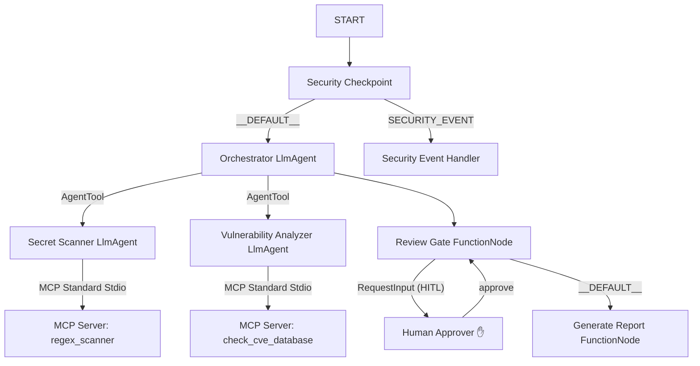

# Cyber Shield Agent — Submission Write-Up

## Problem Statement
In modern software development, security issues such as exposed secrets (API keys, private keys, passwords) and vulnerable dependency libraries are frequently introduced during coding. Finding these issues late in the development lifecycle leads to high remediation costs. The **Cyber Shield Agent** solves this by providing an automated, secure, and interactive multi-agent workspace scanner that checks code and package manifests before deployment.

## Solution Architecture
The agent uses a graph-based workflow layout to coordinate parsing, safety gating, scanning, and final reporting.

## Concepts Used & File References

1.  **ADK Workflow Graph API (ADK 2.0):** Used to construct the workflow layout with nodes, conditional edges, and start/end points.
    *   *Reference:* `cyber_shield_workflow` in [app/agent.py](file:///c:/Users/syed%20aafreen/OneDrive/Desktop/capstone-project/kaggle/cyber-shield-agent/app/agent.py#L171-L182)
2.  **LlmAgent (LLM-Driven Sub-agents):** Specialized sub-agents loaded with domain-specific system instructions and output schemas.
    *   *Reference:* `secret_scanner`, `vuln_analyzer`, and `orchestrator` in [app/agent.py](file:///c:/Users/syed%20aafreen/OneDrive/Desktop/capstone-project/kaggle/cyber-shield-agent/app/agent.py#L42-L103)
3.  **AgentTool (Sub-Agent Delegation):** Allows the orchestrator LlmAgent to dynamically query sub-agents as tools.
    *   *Reference:* `tools=[AgentTool(secret_scanner), AgentTool(vuln_analyzer)]` in [app/agent.py](file:///c:/Users/syed%20aafreen/OneDrive/Desktop/capstone-project/kaggle/cyber-shield-agent/app/agent.py#L98)
4.  **MCP Server (Model Context Protocol):** Standardized external tools protocol running local processes via stdio transport.
    *   *Reference:* [app/mcp_server.py](file:///c:/Users/syed%20aafreen/OneDrive/Desktop/capstone-project/kaggle/cyber-shield-agent/app/mcp_server.py) and `mcp_toolset` in [app/agent.py](file:///c:/Users/syed%20aafreen/OneDrive/Desktop/capstone-project/kaggle/cyber-shield-agent/app/agent.py#L32-L40)
5.  **Security Checkpoint (Workflow Node):** Pre-execution node that scrubs PII, blocks prompt injections, and enforces content payload size bounds.
    *   *Reference:* `security_checkpoint()` in [app/agent.py](file:///c:/Users/syed%20aafreen/OneDrive/Desktop/capstone-project/kaggle/cyber-shield-agent/app/agent.py#L107-L157)
6.  **Agents CLI (Toolchain & Scaffolding):** Used to scaffold, build, run, and host the agent.
    *   *Reference:* `agents-cli scaffold create` and `adk web` commands

## Security Design

The project enforces multiple layers of security guardrails within the `security_checkpoint` node:
*   **PII Scrubbing:** Email addresses and phone numbers matching regex patterns are replaced with redact strings before processing to protect user privacy.
*   **Prompt Injection Gating:** Scans input text for keywords like `ignore previous instructions` or `bypass security`. If flagged, the workflow routes to `security_event_handler` instead of executing LLM agents.
*   **Content Size Limit:** Imposes a strict limit of 10,000 characters to prevent denial-of-service/resource-exhaustion attacks.
*   **Structured JSON Audit Log:** Logs security evaluations via standard streams in JSON format with severity levels (`INFO`, `WARNING`, `CRITICAL`).

## MCP Server Design

The Model Context Protocol (MCP) server runs as a separate process communicating via stdio. It exposes three tools:
1.  **`regex_scanner`:** Runs high-performance regular expression checks to match common credentials (e.g., Gemini API keys, generic tokens, RSA private keys). Used by the `secret_scanner` sub-agent.
2.  **`check_cve_database`:** Queries a local database mapping package names and versions to known CVE entries (e.g. Django ReDoS, urllib3 proxy leak). Used by the `vuln_analyzer` sub-agent.
3.  **`audit_log_exporter`:** Writes structured scan summaries to audit log files on the local filesystem.

## Human-in-the-Loop (HITL) Flow

*   **Trigger:** If the orchestrator detects high-severity security findings (secrets exposed or packages with critical vulnerability CVEs), the `review_gate` node checks if `user_approval` has been received.
*   **State Pause:** If not approved, the node yields `RequestInput`, pausing execution.
*   **Resolution:** The user is prompted to type `"approve"` in the playground UI. Once submitted, the session resumes, the node state updates, and the final report is compiled. If denied, scan report generation is aborted.

## Demo Walkthrough
Refer to the three scenarios documented in the [README.md](file:///c:/Users/syed%20aafreen/OneDrive/Desktop/capstone-project/kaggle/cyber-shield-agent/README.md#l40-l80):
*   *Case 1:* Validates clean script scanning.
*   *Case 2:* Validates key/vulnerability detection, HITL interruption, user approval, and report compiling.
*   *Case 3:* Validates prompt injection filtering.

## Impact / Value Statement
The Cyber Shield Agent increases code compliance, saves developers time by identifying vulnerabilities locally during the coding phase, and guarantees that LLM execution is safe from adversarial attacks.
